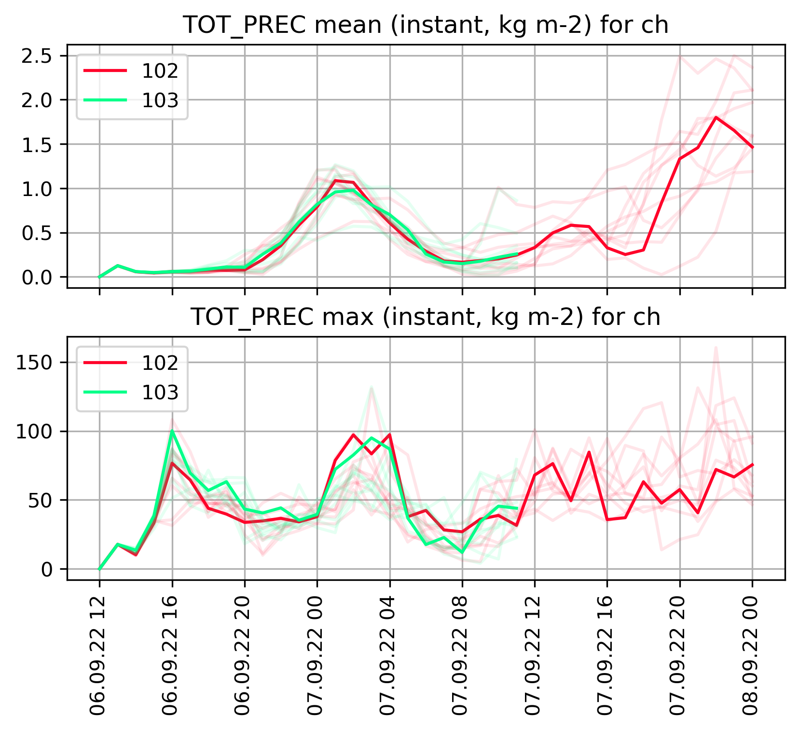

# ICON time series
Visualise time series of ICON data.




This package provides functionalities to display time series from ICON output files. It handles GRIB input (necdf support is currently being developed) on the native. The package should actually also support COSMO data and data on a regular rotated pole grid, but this is features are less tested and might be buggy.

## Quick start
0. Activate conda, and ([optionally](#setup)) install mamba into your base environment: `conda install -c conda-forge mamba`
1. Create an environment and install the dependencies: `tools/setup_env.sh -m` (remove `-m` flag if you dont use mamba)
2. Activate the environment: `conda activate icon-timeseries`
3. Install the package: `pip install --no-deps .`
4. Setup ecCodes environment (only needs to be done once for the conda environment):
    - `tools/setup_grib_env.sh`
    - `conda deactivate; conda activate icon-timeseries`
6. Check the installation: `pytest`

You are now ready to go! For more information read below.

If the tests fail, contact the package administrator Claire Merker.

## Content
The main functionalities of this package are:
* reading
  * GRIB data
  * unstructured (and regular grids for some features)
  * ensemble data
  * multiple runs/experiments
  * optional dask parallelisation available
* data selection
  * model variable and level to display
  * domain that can be customised
  * nearest neighbour grid point to a lon/lat location
* data processing
  * computation of average or maximum for the domain
  * de-averaging/de-accumulation of aggregated quantities
* plotting
  * time series visualisation for multiple runs
  * time series visualisation for ensemble data
  * histograms for value distributions

The functions of the package can be used in scripts or via pre-defined command-line tools. Following command-line tools are provided:
* `icon-timeseries meanmax`: time series of domain average and domain maximum of a model variable on a given level (can display multiple experiments, domains can be customised and added in `src/resources/domains.yaml`)
* `icon-timeseries quicklook-domain`: map plot of the considered domain
* `icon-timeseries nearest-neighbour`: time series of the values of a model variable at the grid point closest to the given location (can display multiple experiments)
* `icon-timeseries histograms`: histograms of the values of a model variable (can display multiple experiments)

In order to use more than one dask worker for the parallelisation, the job needs to be send to the slurm queue (`postproc`). A script for `sbatch` containing an example call for `icon-timeseries meanmax` is provided: `sbatch.sh`

_Warning:_ The support of data on regular lat/lon grids is not implemented for every feature, and is also not tested. Please use it with care! If a feature does not support data on a regular grid, it can probably be added easily. it might be worth to look at the code.

## Developing in icon-timeseries

This section provides some more detailed information on the package and some guidance for the development process. Read it carefully, especially if you are new to Python and/or Python development in APN. Also refer to `CONTRIBUTING.md` for more information.

### Setup

Once you cloned this repository, install the package dependencies with the provided script `tools/setup_env.sh`.
Check available options with
```bash
tools/setup_env.sh -h
```

We distinguish pinned installations based on exported (reproducible) environments and free installations where the installation
is based on top-level dependencies listed in `requirements/requirements.yml`. If you start developing, you might want to do an unpinned installation and export the environment:

```bash
tools/setup_env.sh -u -e -n <package_env_name>
```
*Hint*: If you are the package administrator, it is a good idea to understand what this script does, you can do everything manually with `conda` instructions.

*Hint*: Use the flag `-m` to speed up the installation using mamba. Of course you will have to install mamba first. We recommend to install mamba into your base environment `conda install -c conda-forge mamba`. If you install mamba in another (maybe dedicated) environment, environments installed with mamba will be located in `<miniconda_root_dir>/envs/mamba/envs`, which is not very practical.

The package itself is installed with `pip`. For development, install in editable mode:

```bash
conda activate <package_env_name>
pip install --editable .
```

*Warning:* Make sure you use the right pip, i.e. the one from the installed conda environment (`which pip` should point to something like `path/to/miniconda/envs/<package_env_name>/bin/pip`).

Once your package is installed, run the tests by typing:

```bash
conda activate <package_env_name>
pytest
```

If the tests pass, you are good to go. If not, contact the package administrator Claire Merker. Make sure to update your requirement files and export your environments after installation every time you add new imports while developing.

### ecCodes for GRIB decoding

Since this package uses cfgrib to decode GRIB data, make sure to run `tools/setup_grib_env.sh` with your conda environment active to setup ecCodes correctly. You need to deactivate and reactivate the conda environment for that settings to be applied correctly. This step only needs to be done once, the settings are then stored in the conda environment! In case of an upgrade of the ecCodes versions and definitions supported by spack, this setup script might need to be updated. If you need a personalised version of ecCodes definitions that is not supported by spack, you can specify the path to your version in `GRIB_DEFINITION_PATH` (and `GRIB_SAMPLES_PATH` if needed) in `tools/setup_grib_env.sh`.

### Code structure

The structure of the package is currently simple:
* `src/ion_timeseries`: Source code of the package. Modules for features and utilities, and for the command-line tools (`cli.py`).
* `src/resources`: the file `domains.yaml` stores the pre-defined domains and can be extended for user-defined domains
* `tests/test_icon_timeseries`: Unit and integration tests, run with `pytest`.
- `tools/`: Helper scripts primarily for setup and development
    - `run-mypy.sh`: Run script for the static type checker `mypy`.
    - `setup_env.sh`: Script to create new conda environments; see `tools/setup_env.sh -h` for all available options.
    - `setup_grib_env.sh`: Script that sets the ecCodes environment variables in the conda environment.
    - `setup_miniconda.sh`: Script to install miniconda.
* `requirements/`: Project dependencies and environment
  * `requirements.yml`: Top-level runtime and development dependencies with minimal version restrictions (typically a minimum version or a version range); kept manually.
  * `environment.yml`: Full tree of runtime and development dependencies with fully specified ('pinned') version numbers; created with `conda env export`.
  This should only be updated with a tested, stable environment!
* `docs`: Documentation. Could be build automatically with sphinx to generate html or pdf documentation, currently not set up.
* `jenkins/`: Templates for Jenkins plans, currently not used.
* `.github`: Definition files for GitHub Actions workflows
* `.github/workflows/`: [GitHub Actions](https://docs.github.com/en/actions) workflows, e.g., checks that are run when certain branches are pushed
* `.gitignore`: Files and folders ignored by `git`.
* `.pre-commit-config.yaml`: Configuration of pre-commit hooks, which are formatters and checkers run before a successful commit.
* `AUTHORS.md`: Project authors.
* `CONTRIBUTING.md`: Instructions on how to contribute to the project.
* `HISTORY.md`: List of changes for each version of the project.
* `LICENSE`: License of the project.
* `MANIFEST.in`: Files installed alongside the source code.
* `pyproject.toml`: Main package specification file, including build dependencies, metadata and the configurations of development tools like `black`, `pytest`, `mypy` etc.
* `README.md`: Description of the project.
* `USAGE.md`: Information on how to use the package.

### How to provide executable scripts

By default, a single executable script called icon-timeseries is provided. It is created when the package is installed. When you call it, the main function (`cli`) in `src/icon_timeseries/cli.py` is called.

When the package is installed, an executable script named `icon-timeseries` is created in the bin folder of the active conda environment. Upon calling this script in the shell, the `main` function in `src/icon_timeseries/cli.py` is executed.

The scripts, their names and entry points are specified in `pyproject.toml` in the `[project.scripts]` section. Just add additional entries to provide more scripts to the users of your package.

### Testing and code standards

Testing your code and compliance with the most important Python standards is a requirement for Python software written in APN. To make the life of package
administrators easier, the most important checks are run automatically on GitHub actions. If your code goes into production, it must additionally be tested on CSCS machines, which is only possible with a Jenkins pipeline (GitHub actions is running on a GitHub server).

#### Testing

Tests can be triggered with `pytest` from the command line. You should run the tests right after installation to be sure that everything is fine. Also, once you implemented a feature (and of course you also
implemented a meaningful test ;-)), you are likely willing to commit it. Test it first!

```bash
conda activate <package_env_name>
cd <package-root-dir>
pytest
```

`pytest` can also be run on just one file during the development of a test:

```bash
pytest test/test_icon_timeseries/<files>
```

Currently tests are not run automatically in GitHub Actions or with Jenkins. You have to test your developments locally.

#### Pre-commit

Pre-commit hooks can be configured to run various formatters and linters automatically. If you use the blueprint as is, pre-commit will not be triggered locally but only if you push to the main branch (or push to a PR to the main branch). If you consider it useful, you can set up pre-commit to run locally before every commit by initializing it once. In the root directory of
your package, type:

```bash
pre-commit install
```

If you run `pre-commit` without installing it before (line above), it will fail and the only way to recover it, is to do a forced reinstallation (`conda install --force-reinstall pre-commit`).

You can also just run pre-commit selectively, whenever you want by typing (`pre-commit run --all-files`). Note that mypy and pylint take a bit of time, so it is really up to you, if you want to use pre-commit locally or not.

In any case, the linters will run at the latest on the GitHub actions server,
when you push your changes to the main branch. Note that pytest is currently not invoked by pre-commit or Jenkins, so it will not run automatically.

#### GitHub actions

`.github/workflows/pre-commit.yml` contains a hook that will trigger the creation of your environment (unpinned) on the GitHub actions server and
then run various formatters and linters through pre-commit (tests are currently not included). This hook is only triggered upon pushes to the main branch (in general: don't do that) and in pull requests to the main branch (definitely do that).

#### Jenkins

Two jenkins plans are available in the `jenkins/` folder. On the one hand `jenkins/Jenkinsfile` controls the nightly (weekly, monthly, ...) builds, on the other hand
`jenkins/JenkinsJobPR` controls the pipeline invoked with the command `launch jenkins` in pull requests on GitHub. Your jenkins pipeline will not be set up
automatically. If you need to run your tests on CSCS machines, contact DevOps to help you with the setup of the pipelines. Otherwise, you can ignore the jenkinsfiles and exclusively run your tests and checks on GitHub actions.

### Versioning

The version should be increased and a release created after major changes. This should be discussed with the package administrator. Information on versioning can be found in `CONTRIBUTING.md`.

### Managing dependencies

ICON time series uses [Conda](https://docs.conda.io/en/latest/) to manage dependencies. (Also check out [Mamba](https://mamba.readthedocs.io/en/latest/) if you like your package installations fast.) Dependencies are specified in YAML files, of which there are two:

- `requirements/requirements.yml`: Top-level runtime and development dependencies with minimal version restrictions (typically a minimum version or a version range); kept manually.
- `requirements/environment.yml`: Full tree of runtime and development dependencies with fully specified ('pinned') version numbers; created with `conda env export`.

The pinned `environment.yml` file should be used to create reproducible environments for development or deployment. This ensures reproducible results across machines and users. The unpinned `requirements.yml` file has two main purposes: (i) keeping track of the top-level dependencies, and (ii) periodically updating the pinned `environment.yml` file to the latest package versions.

After introducing new first-level dependencies to your requirements, you have to update the environment files in order to be able to create reproducible environments for deployment and production.
Updating the environment files involves the following steps:

1. Creating an environment from your top-level dependencies in `requirements/requirements.yml`
2. Exporting this environment to `requirements/environment.yml`

Alternatively, use the provided script

```bash
./tools/setup_env.sh -ue
```

to create a environment from unpinned (`-u`) runtime and development dependencies and export (`-e`) it (consider throwing in `-m` for good measure to speed things up with `mamba`).


## Credits

This package was created with [`copier`](https://github.com/copier-org/copier) and the [`MeteoSwiss-APN/mch-python-blueprint`](https://meteoswiss-apn.github.io/mch-python-blueprint/) project template. For more information on development tools or on how to update to a newer version of this template, please refer to the GitHub Pages documentation.
